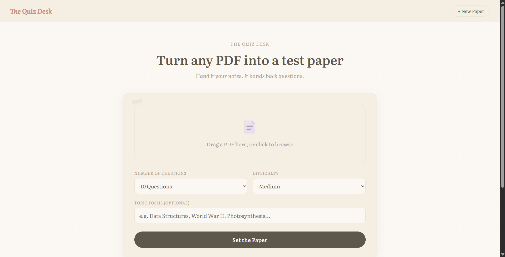

# AI Quiz Generator

An ASP.NET Core web application that generates multiple-choice quizzes from uploaded PDF documents using the Groq API (LLaMA 3.3 70B).

## Preview



## Features

- PDF text extraction and parsing
- AI-generated multiple-choice questions (5–20 per quiz)
- Configurable difficulty (easy / medium / hard)
- Optional topic filtering
- Session-based quiz state and scoring
- Client-side timer, tracked and stored on submission
- Flag-for-review on individual questions
- Keyboard input support (1–4 for answer selection, arrow keys for navigation)
- Per-question explanations covering both the correct answer and the most common incorrect choice
- Print-to-PDF export of results
- Local quiz history via browser `localStorage`

## Tech Stack

- **Backend:** ASP.NET Core MVC (.NET 9+), C#
- **AI Provider:** Groq API, `llama-3.3-70b-versatile`
- **Views:** Razor (`.cshtml`)
- **Frontend:** Vanilla JavaScript, CSS (no frameworks)
- **PDF Parsing:** Custom text extraction service

## Setup

1. Clone the repository
   ```bash
   git clone https://github.com/shrutirathore25/AIQuizGenerator-.git
   cd AIQuizGenerator-
   ```

2. Obtain a Groq API key from [console.groq.com/keys](https://console.groq.com/keys)

3. Copy the example configuration file
   ```bash
   cp appsettings.example.json appsettings.json
   ```
   Set the `ApiKey` value under `"Groq"` in `appsettings.json`.

4. Restore dependencies and run
   ```bash
   dotnet restore
   dotnet run
   ```

5. Navigate to `http://localhost:5200`

## Project Structure

```
Controllers/       Request handling: upload, generation, submission, scoring
Models/            QuizQuestion and QuizSession data models
Services/          PDF extraction, AI question generation, scoring logic
Views/             Razor views (Upload, Take, Result)
wwwroot/           Static assets (CSS, JS)
```

## Configuration

| Key | Description |
|---|---|
| `Groq:ApiKey` | Your Groq API key |
| `Groq:Model` | Model identifier (default: `llama-3.3-70b-versatile`) |

`appsettings.json` is excluded via `.gitignore`. Use `appsettings.example.json` as the template for required configuration keys.
